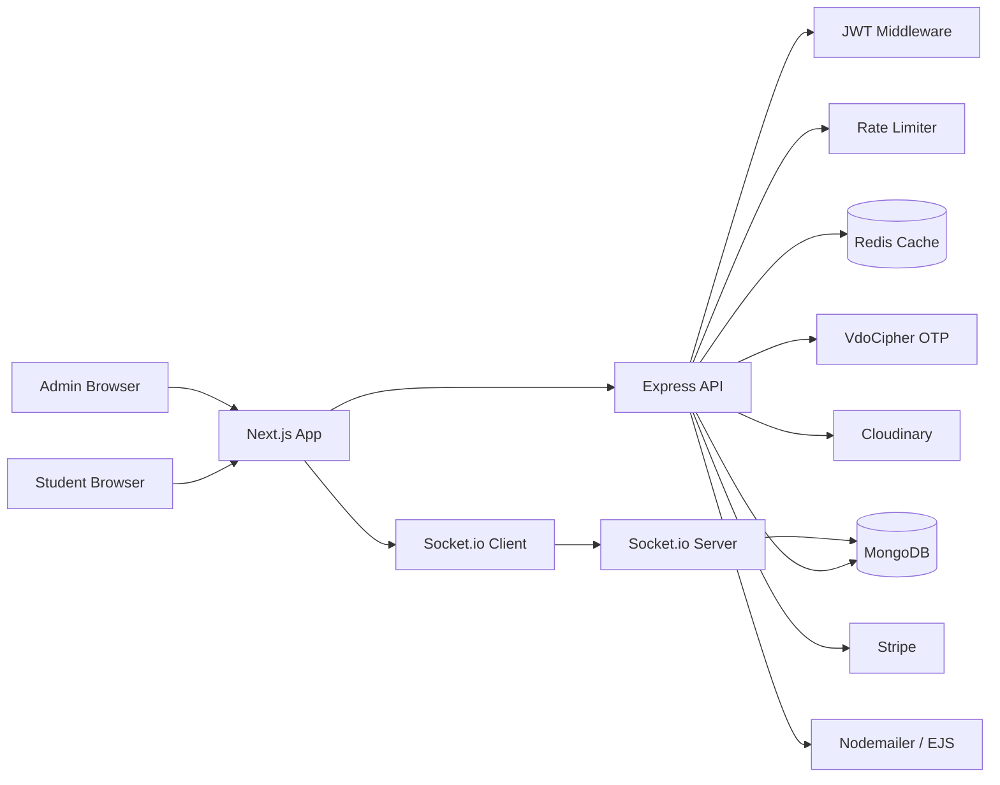
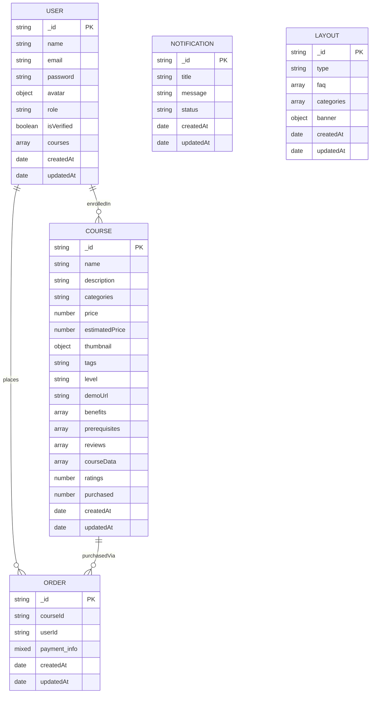
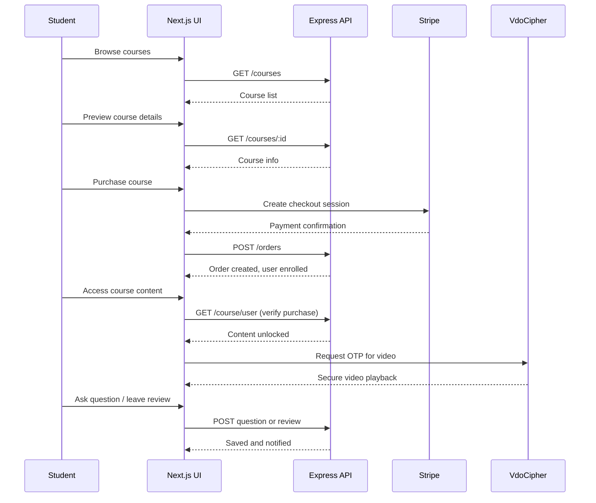
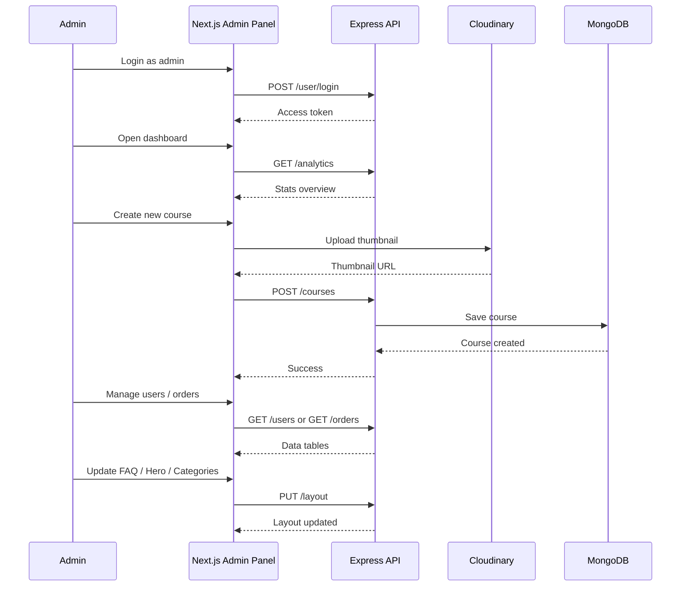

# Zone Your Learning Operations (zylo)

Project overview
.Name: ZyLo
.One liner: Zylo is a Learning Management System (LMS) that connects students with teachers through structured courses. Students can browse, purchase, and access video-based courses with interactive Q&A, reviews, and real-time notifications. Admins manage content, users, and analytics through a dedicated dashboard.

## Repository

This is a monorepo containing both frontend and backend:

- `client/` — Next.js application (UI)
- `server/` — Express API (backend services)

## Goals

- Provide a multi-role platform for students and admins.
- Allow students to enroll in courses, watch DRM-protected videos, ask questions, and leave reviews.
- Enable admins to create, edit, and manage courses, users, and platform content.
- Secure course content with DRM and purchase verification.
- Deliver real-time notifications for replies, reviews, and updates.
- Offer analytics dashboards for tracking users, courses, and enrollments.
- Process secure payments via Stripe.

## Tech Stack

| Layer | Technology | Purpose |
|-------|------------|---------|
| Frontend | Next.js 16, React 19, TypeScript, Tailwind CSS 4, Redux Toolkit | SSR, responsive UI, state management |
| Auth | JWT (custom), bcryptjs, cookie-parser | Authentication and authorization |
| Backend | Express 4, TypeScript, Mongoose | REST API, business logic |
| Database | MongoDB | Persistent storage for users, courses, orders, notifications, layouts |
| Cache | Redis (ioredis) | Course data caching, session support |
| Videos | VdoCipher (DRM), Cloudinary | Secure video playback, image hosting |
| Payments | Stripe | Course purchase and checkout |
| Email | Nodemailer, EJS | Transactional emails and reply notifications |
| Real-Time | Socket.io | Live notifications and updates |
| Scheduling | node-cron | Background scheduled tasks |
| Rate Limiting | express-rate-limit | API abuse protection |

## System Architecture



## Database ERD



## User Flow

### Student Flow



### Admin Flow



## Key Features

### For Students
- Browse and filter all available courses.
- Preview course details, benefits, prerequisites, and demo videos.
- Purchase courses securely via Stripe checkout.
- Access purchased course content with DRM-protected video playback.
- Ask questions on specific course sections and view teacher replies.
- Leave ratings and reviews on completed or in-progress courses.
- Receive real-time notifications for replies and updates.
- Manage profile and change password.

### For Admins
- Secure admin-only dashboard with analytics widgets.
- Create, edit, and delete courses with thumbnails and video content.
- Upload and manage course media via Cloudinary and VdoCipher.
- View user, course, and order analytics with charts.
- Manage platform layout: hero banner, FAQ, and categories.
- View all users, orders, and invoices.
- Manage team members and role-based access.
- Send and manage notifications.

## Core Features

- **Course Management**: Full CRUD for courses including sections, videos, links, benefits, and prerequisites.
- **DRM Video Protection**: VdoCipher OTP-based secure video playback with time-limited tokens.
- **Q&A and Reviews**: Nested question-reply threads and star ratings with comments per course.
- **Purchase Verification**: Access to course content is gated by checking the user's enrolled courses array and order records.
- **Caching Layer**: Redis caches frequently accessed course data for improved performance.
- **Real-Time Notifications**: Socket.io pushes live updates for new replies, reviews, and system notifications.
- **Email Notifications**: Automated emails for account activation, order confirmations, and question replies using EJS templates.
- **Analytics**: Aggregated dashboards for user growth, course enrollments, and revenue tracking.
- **Rate Limiting**: API endpoints are protected with express-rate-limit to prevent abuse.
- **Responsive UI**: Tailwind CSS-based design with dark mode support via next-themes.
- **State Management**: Redux Toolkit handles global state for auth, courses, orders, and analytics.
- **TypeScript**: Full-stack type safety across client and server.

## API Endpoints

| Route | Description |
|-------|-------------|
| `POST /api/v1/user/register` | Register new user |
| `POST /api/v1/user/login` | Login user |
| `GET /api/v1/user/me` | Get current user profile |
| `PUT /api/v1/user/update` | Update user profile |
| `GET /api/v1/courses` | Get all courses |
| `POST /api/v1/courses` | Create new course (admin) |
| `GET /api/v1/courses/:id` | Get single course |
| `PUT /api/v1/courses/:id` | Update course (admin) |
| `GET /api/v1/course/user` | Get user-specific course content |
| `POST /api/v1/orders` | Create order after payment |
| `GET /api/v1/orders` | Get all orders (admin) |
| `GET /api/v1/notifications` | Get user notifications |
| `PUT /api/v1/notifications/:id` | Mark notification as read |
| `GET /api/v1/analytics/users` | User analytics (admin) |
| `GET /api/v1/analytics/courses` | Course analytics (admin) |
| `GET /api/v1/analytics/orders` | Order analytics (admin) |
| `GET /api/v1/layout` | Get platform layout |
| `PUT /api/v1/layout` | Update layout (admin) |

## Setup

1. Clone the repository:
   ```bash
   git clone <repository-url>
   cd Zylo
   ```

2. Install server dependencies:
   ```bash
   cd server
   npm install
   ```

3. Install client dependencies:
   ```bash
   cd ../client
   npm install
   ```

4. Create environment files (see Environment Variables below).

5. Run the development servers:
   ```bash
   # Terminal 1 - Backend
   cd server
   npm run dev

   # Terminal 2 - Frontend
   cd client
   npm run dev
   ```

## Environment Variables

Create a `.env` file inside the `server/` directory with the following variables:

| Variable | Description |
|----------|-------------|
| `PORT` | Server port (default: 5000) |
| `MONGODB_URI` | MongoDB connection string |
| `ACCESS_TOKEN` | JWT secret for access tokens |
| `REFRESH_TOKEN` | JWT secret for refresh tokens |
| `JWT_SECRET` | General JWT secret |
| `REDIS_URL` | Redis connection string |
| `CLOUDINARY_CLOUD_NAME` | Cloudinary cloud name |
| `CLOUDINARY_API_KEY` | Cloudinary API key |
| `CLOUDINARY_API_SECRET` | Cloudinary API secret |
| `VDOCIPHER_API_SECRET` | VdoCipher API secret |
| `STRIPE_SECRET_KEY` | Stripe secret key |
| `STRIPE_PUBLISHABLE_KEY` | Stripe publishable key |
| `SMTP_HOST` | SMTP server host |
| `SMTP_PORT` | SMTP server port |
| `SMTP_USER` | SMTP username |
| `SMTP_PASS` | SMTP password |
| `CLIENT_URL` | Frontend URL for CORS |

## Deployment

- **Frontend**: Deploy the `client/` directory to Vercel.
- **Backend**: Deploy the `server/` directory to Railway, Render, or any Node.js hosting platform.
- **Database**: Use MongoDB Atlas for managed MongoDB hosting.
- **Cache**: Use Upstash Redis or Redis Cloud for managed Redis hosting.
- **Media**: Cloudinary and VdoCipher are managed externally.
- **Payments**: Configure Stripe webhook endpoints pointing to the deployed backend URL.

