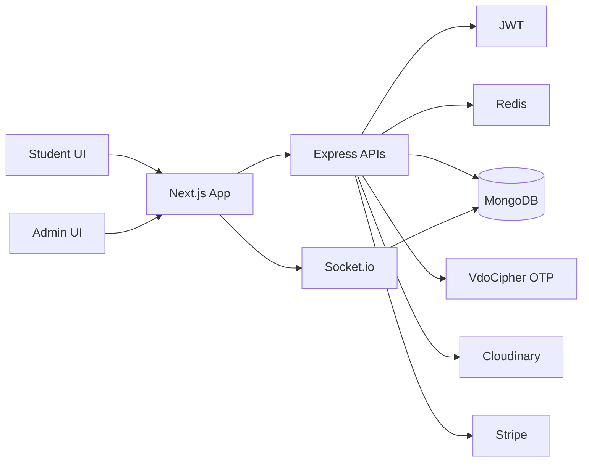
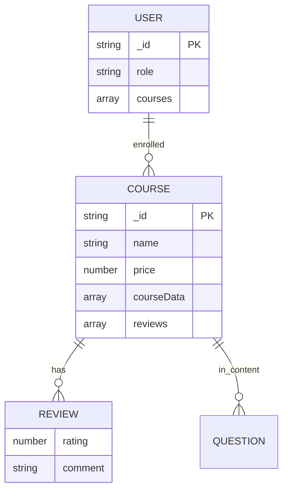
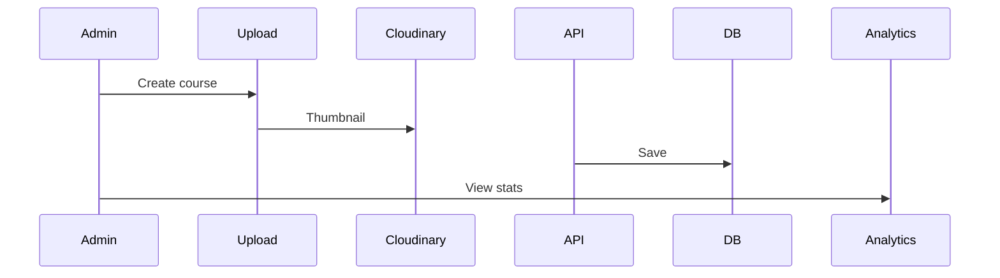

# 🎓 Zylo - Learning Management System (LMS)

[](https://nextjs.org)
[](https://react.dev)
[](https://mongoosejs.com)
[]()
[](https://stripe.com)

**One-liner**: Platform for students to browse, purchase, and access courses with interactive Q&A, teacher replies, reviews, and admin management.

**Description**: ZyLo connects students with teachers for learning via structured courses, video content (DRM protected), questions/replies, ratings, and analytics.

## Goals
- Multi-Role: Students enroll/complete courses; Admins manage content/users.
- Course Management: Listings, previews, paid access.
- Interactive Learning: Q&A sections, teacher replies, notifications.
- Secure Content: VdoCipher DRM, purchase verification.
- Dashboards: Admin analytics (users/courses/enrollments).
- Payments: Stripe checkout.
- Real-Time: Socket notifications.

## Tech Stack

| Layer | Technology | Purpose |
|-------|------------|---------|
| Frontend | Next.js 16 App Router + React 19 + TS + Tailwind 4 + Redux Toolkit | SSR courses, responsive UI, state mgmt |
| Auth | NextAuth + JWT | Login/Signup, Google/GitHub |
| Backend | Express 5 + TS + Mongoose | REST APIs, course CRUD |
| DB | MongoDB | Courses/Users/Orders/Notifications |
| Cache | Redis | Course data, sessions |
| Videos | VdoCipher + Cloudinary | DRM playback, thumbnails |
| Payments | Stripe | Course enrollment |
| Email | Nodemailer + EJS | Reply notifications |
| Real-Time | Socket.io | Updates |

## System Architecture



## Database ERD



## Key Features

**Student**:
- Browse/filter courses, previews.
- Stripe purchase for lifetime access.
- Course content (videos/sections/links).
- Ask questions, view replies.
- Leave reviews/ratings.

**Admin**:
- Create/edit/delete courses (thumbnails/videos).
- User/course analytics.
- Manage categories/FAQ/hero.

**Interactive**:
- Q&A per content section (replies w/ email).
- Notifications (new reply/review).

## Application Flows

**Student Enrollment & Learning**

```mermaid
sequenceDiagram
  Student->>Courses: Browse
  Courses->>API: GET /courses
  API->>Redis: Cache check
  Student->>Details: Preview
  Student->>Stripe: Buy
  Stripe->>API: POST /order (add to user.courses)
  Student->>Content: Access courseData
  Student->>API: GET /course/user (verify purchase)
  Student->>Q&A: Add question
  API->>Notify: Teacher email
```

**Admin Course Management**



## API Architecture
- `/course`: CRUD, getAll/single, userContent.
- `/user`: Auth, profile.
- `/analytics`: Dashboards.
- Protected: Purchase checks, admin only.

## Challenges & Solutions
- **Secure Videos**: VdoCipher OTP (300s TTL).
- **Purchase Gate**: Check user.courses array.
- **Q&A**: Nested replies, notifications/email.
- **Caching**: Redis for courses (7 days).
- **Scalability**: Indexed queries, rate-limit.

## Best Practices
- TypeScript everywhere.
- Error middleware, Yup validation.
- Reusable components (CourseCard, Loader).
- Dark mode (next-themes).

## Setup

1. Clone & install:
   ```
   npm install
   cd server && npm install
   cd ../client && npm install
   ```

2. Env (server/.env):
   ```
   MONGODB_URI=...
   JWT_SECRET=...
   VDOCIPHER_API_SECRET=...
   CLOUDINARY_URL=...
   STRIPE_SECRET_KEY=...
   REDIS_URL=...
   ```

3. Dev:
   - Backend: `cd server && npm run dev` (localhost:5000)
   - Frontend: `cd client && npm run dev` (localhost:3000)

## Deployment
- Frontend: Vercel.
- Backend: Railway/Render (Mongo Atlas, Redis).

Task complete: Code-adjusted LMS README added.

